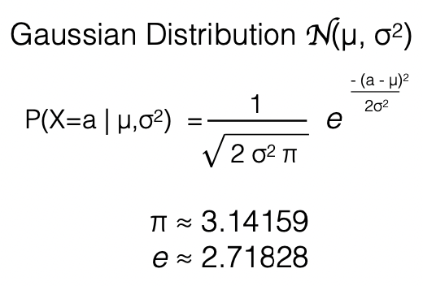
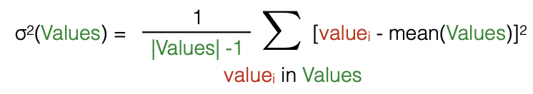
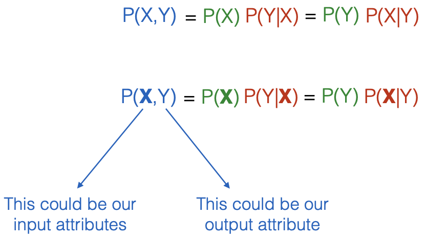
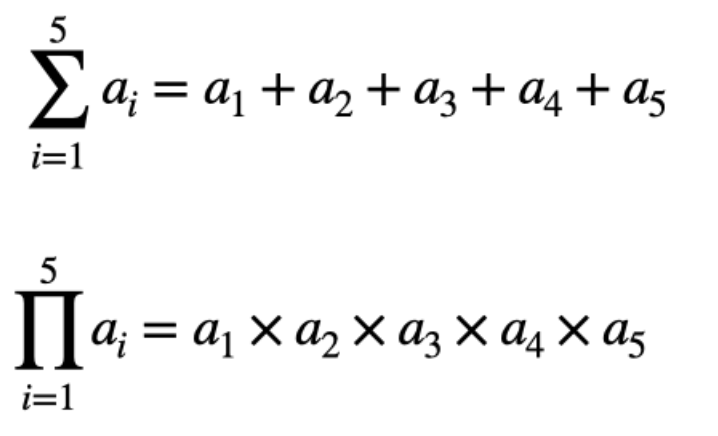
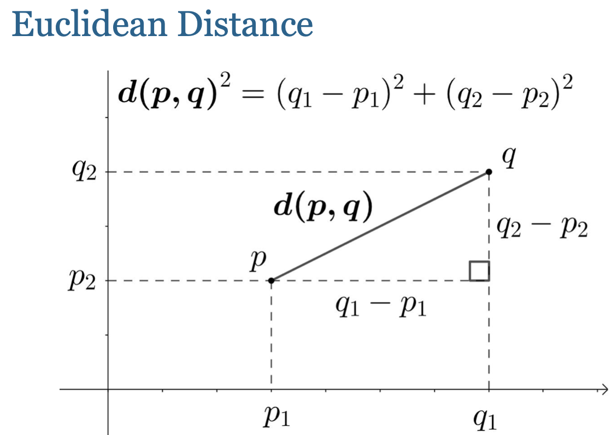

### Probability Density Functions : use Gaussian distribution
<!-- 
   -->

 

---

### Laplace Smoothing : +1 value for each sample, to guarantee no 0 effect the result  

---

### Distributions on Multiple Discrete or Continuous Random Variables  
<!-- 
   -->

---

### summation or product of several items  
<!-- 
   -->
  

  
  
---

<!-- 
 -->
  

