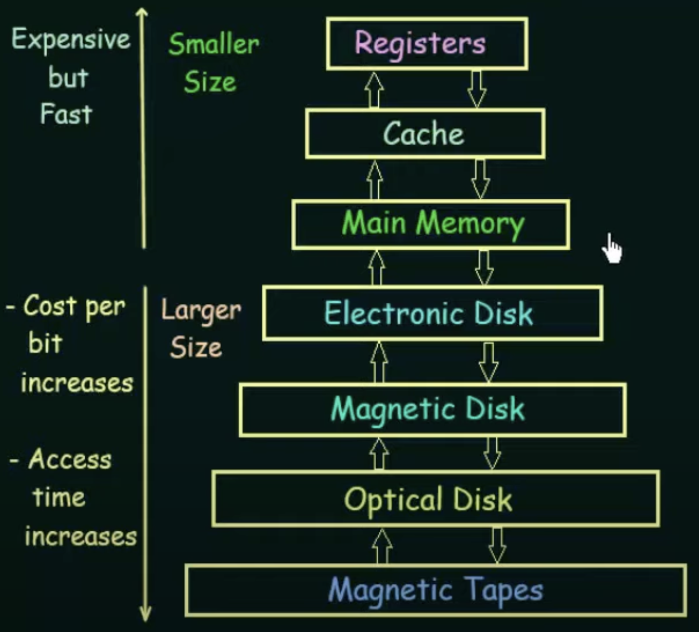

    Operating System Concepts
    Book by Abraham Silberschatz; Greg Gagne; Peter B Galvin - 2018

#   Operating system

software manage hardware  
an intermediary between user and hardware  

Computer = `hardware` `operating System` `application programs` `user`
<div  align="center" width = "auto" height = "auto" >    

</div>

<div  align="center" >    

</div> 
<div  align="center" >   

</div> 

problem: CPU time, memory space, storage space, I/O devices, and so on.

```
$FTN—Execute the FORTRAN compiler.  
$ASM—Execute the assembler.  
$RUN—Execute the user program. 
```

<div  align="center" >  
Storage Structure: 

</div> 

 


