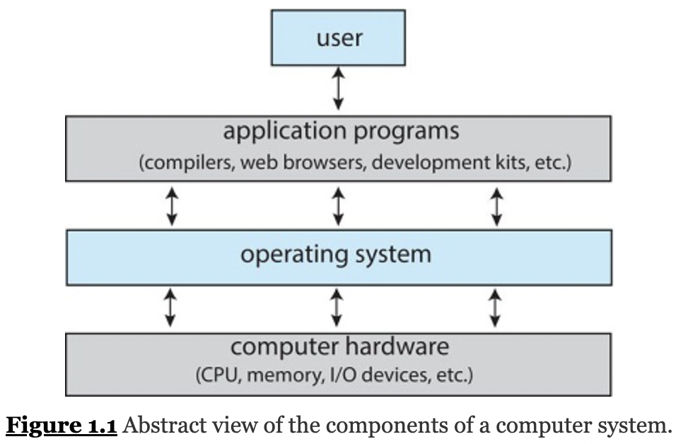
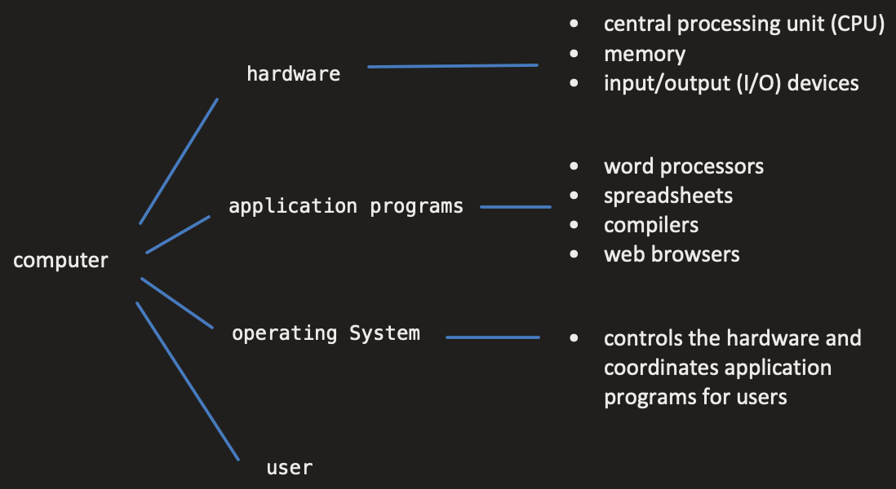
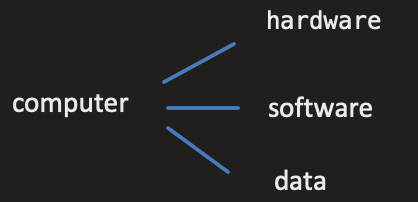

    Operating System Concepts
    Book by Abraham Silberschatz; Greg Gagne; Peter B Galvin - 2018

#   Operating system

software manage hardware  
an intermediary between user and hardware  
`CPU` `memory` `I/0 devides (storage)` --- allocate these resources to programs  

Computer = `hardware` `operating System` `application programs` `user`

    

    

 

    

 

