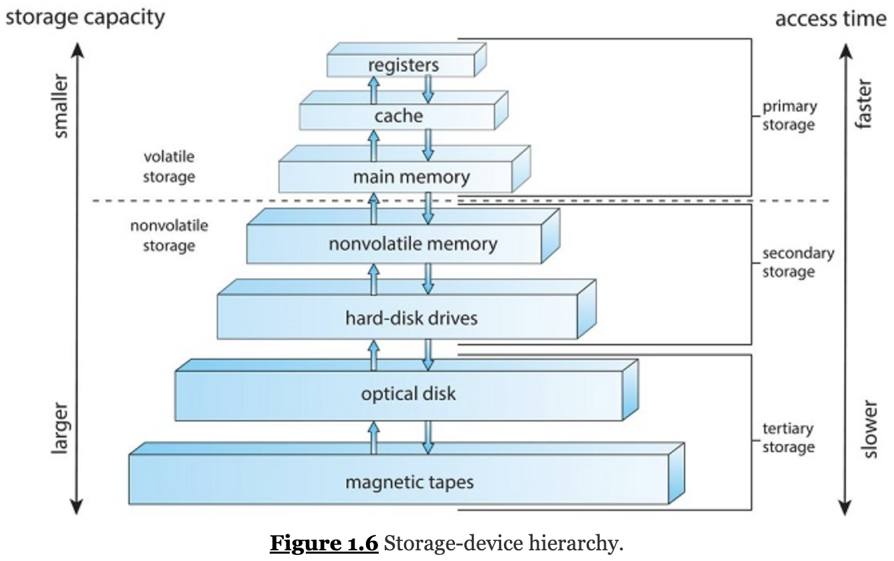

    Operating System Concepts
    Book by Abraham Silberschatz; Greg Gagne; Peter B Galvin - 2018

#   Operating system

software manage hardware  
an intermediary between user and hardware  

Computer = `hardware` `operating System` `application programs` `user`
<div  align="center" width = auto height = auto >    

</div>

<div  align="center" >    

</div> 
<div  align="center" >   

</div> 

problem: CPU time, memory space, storage space, I/O devices, and so on.

```
$FTN—Execute the FORTRAN compiler.  
$ASM—Execute the assembler.  
$RUN—Execute the user program. 
```

<div  align="center">  

</div> 

##   STORAGE DEFINITIONS AND NOTATION
>
>The basic unit of computer storage is the bit. A bit can contain one of two values, 0 and 1. All other storage in a computer is based on collections of bits. Given enough bits, it is amazing how many things a computer can represent: numbers, letters, images, movies, sounds, documents, and programs, to name a few. A byte is 8 bits, and on most computers it is the smallest convenient chunk of storage. For example, most computers don't have an instruction to move a bit but do have one to move a byte. A less common term is word, which is a given computer architecture's native unit of data. A word is made up of one or more bytes. For example, a computer that has 64-bit registers and 64-bit memory addressing typically has 64-bit (8-byte) words. A computer executes many operations in its native word size rather than a byte at a time.
>
>Computer storage, along with most computer throughput, is generally measured and manipulated in bytes and collections of bytes.   
>A `kilobyte`, or `KB`, is `1,024 bytes`;  
>A `megabyte`, or `MB`, is `1,024^2 bytes`;   
>A `gigabyte`, or `GB`, is `1,024^3 bytes`;  
>A `terabyte`, or `TB`, is `1,024^4 bytes`;   
>A `petabyte`, or `PB`, is `1,024^5 bytes`.   
>Computer manufacturers often round off these numbers and say that a megabyte is 1 million bytes and a gigabyte is 1 billion bytes. Networking measurements are an exception to this general rule; they are given in bits (because networks move data a bit at a time).*

`bit` is 0 or 1 (The basic value of computer)  
`byte` is 8 bits

###  Storage Structure: 
<div  align="center" width = auto > 

</div>  

